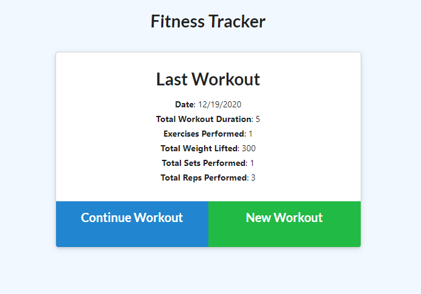
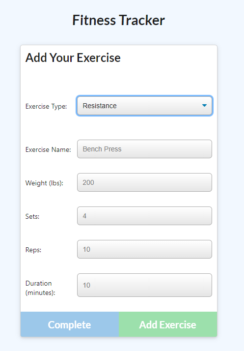
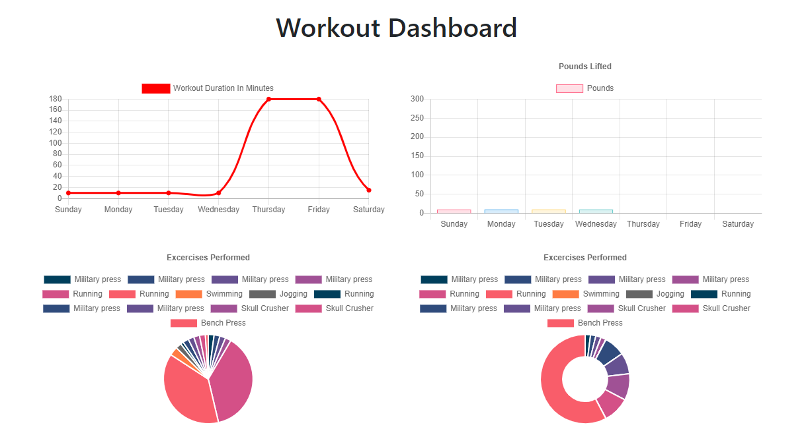

# Fitness-Tracker

A fitness app that will help you keep track of all or your daily workouts. By allowing the user to log workouts and then being able to see your progress through graphs. 

##Technologies Used

Express, Node, Mongoose, MongoDB, Morgan, and Path

## Deployed app

    

##Installation

1. Clone repository.
2. npm install all necessary dependencies.
3. node server.js

##Usage

### Screenshots

1. Main page desplaying your last workout.

2. Fields allowing you to log your next work out.

3. Workout Dashboard giving a summary of your workouts through the week.

